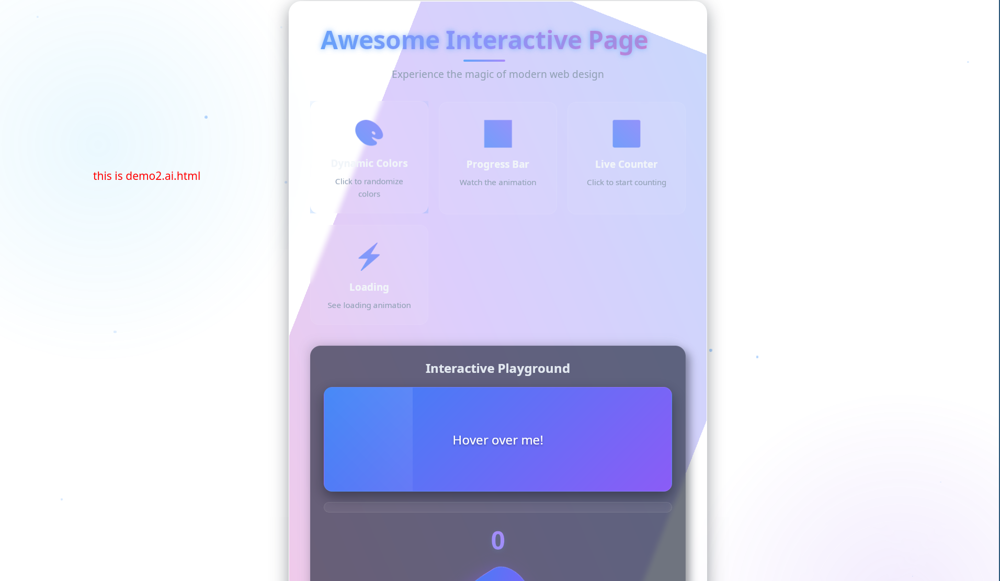

# see more
- https://gitee.com/EEPPEE_admin/htmlbundlergen.cpp

# todo
- probe that I can really host the app to any linux platform?

# usage
```bash
src/htmlbundlergen 
Usage: src/htmlbundlergen <input.html> -o <output.cpp> [--build/-b] [--executable/-e <app-name>]
Example:
  src/htmlbundlergen index.html -o app.cpp -b -e harmony_player
Flags:
  -b/--build      Auto-build the generated C++ file
  -e/--executable Name of the final executable (default: generated_app)
```

# just a codegen that host nice html web page, require web2gtkwebkit2gtk-4.1
## deps
- webkit2gtk-4.1
- clang-19 (or `c++23` require, just modify the `html_bundler_gen.cpp` code to adapt your own compiler)
- require `#embed` feature compiler(clang support this, I don't know gcc)
- pkg-config

# then build selfhost nice html now

# actually example codegen of cpp code, this is the details of this tool
```cpp
// Auto-generated by htmlbundlergen
// Build command: clang++-19 $OUTPUT_FILE -o $EXECUTABLE `pkg-config --cflags --libs webkit2gtk-4.1` -lpthread -ldl -std=c++23 -Wno-c23-extensions
#include <cstdlib>
#include <string>
#include <webview/webview.h>

const char embedded_html[] = {
#embed "demohtmlpage/demo1.ai.html"
    , '\0' 
};

int main() {
  webview::webview wv(true, nullptr);
  // Configure webview
  wv.set_title("selfhosthtmlapp");
  wv.set_size(1000, 700, WEBVIEW_HINT_NONE);

  wv.set_html(embedded_html); // Load embedded HTML
 

  // Run app
  wv.run();
  return 0;
}
```

# screenshots of actually build page
demo1

demo2


# happy hacking
